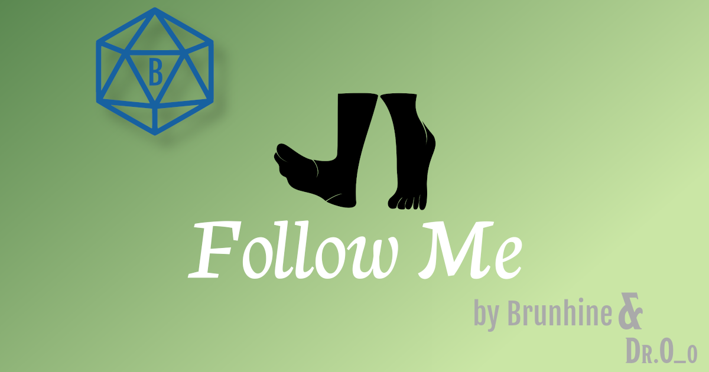

# Follow Me
**Follow Me** is a module for [Foundry VTT](https://foundryvtt.com/  "Foundry VTT") that allows tokens to follow or be followed by other tokens. This is completely system agnostic, and fully customizable to fit right into your game.

 

# Usage
Select your token, hover the mouse over the one you wish to follow and press the "F" key. Your token now follows behind maintaining the same distance. To stop following, simply move your token.

# Installation
It's always better and easier to install modules through in in app browser. Just search for "Follow Me"

To install this module manually:
1. Inside the Foundry "Configuration and Setup" screen, click "Add-on Modules"
2. Click "Install Module"
3. In the "Manifest URL" field, paste the following url:
`https://github.com/oOve/followme/releases/latest/download/module.json`
4. Click 'Install' and wait for installation to complete
5. Don't forget to enable the module in game using the "Manage Module" button

# Localization

# Compatibility
Most recently tested on [Foundry VTT](https://foundryvtt.com/  "Foundry VTT") version `9`.

# Feedback
All feedback and suggestions are welcome. Please contact me on Discord (Brunhine#2182).

Any issues, bugs, or feature requests are always welcome to be reported directly to the [Issue Tracker](https://github.com/Brunhine/FollowMe/issues  "Issue Tracker")

# Licensing
**Follow Me** is a module for [Foundry VTT](https://foundryvtt.com/  "Foundry VTT") by Dr.O after original idea by Brunhine and is licensed under a [Creative Commons Attribution 4.0 International License](http://creativecommons.org/licenses/by/4.0/).

This work is licensed under Foundry Virtual Tabletop [EULA - Limited License Agreement for module development v 0.1.6](https://foundryvtt.com/article/license/).
